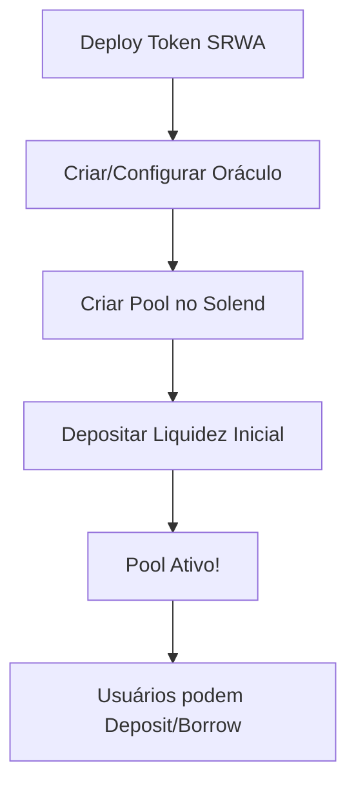

# 🏦 Integração Solend - Documentação Completa

## 📋 Resumo

Esta integração permite que o admin do SRWA crie lending pools no Solend e realize operações de lending/borrowing diretamente pela interface do Admin Panel.

## 🚀 Funcionalidades Implementadas

### 1. **Criação de Pools** (`SolendPoolCreator`)
- Criar novo lending market ou usar market existente
- Adicionar reserves (pools de liquidez) para tokens SRWA
- Configurar parâmetros de risco (LTV, liquidation threshold, APY, etc)
- Suporte a oráculos Pyth e Switchboard

### 2. **Operações de Lending** (`SolendOperations`)
- ✅ **Deposit**: Depositar tokens no pool para ganhar juros
- ✅ **Borrow**: Tomar empréstimos usando colateral
- ✅ **Withdraw**: Retirar tokens depositados
- ✅ **Repay**: Pagar empréstimos ativos

### 3. **Dashboard de Posições**
- Visualizar depósitos ativos
- Visualizar empréstimos ativos
- Monitorar limite de empréstimo
- Acompanhar utilização de colateral
- Ver APYs em tempo real

## 📁 Estrutura de Arquivos

```
src/
├── services/
│   └── solendService.ts              # Service principal de integração
├── hooks/
│   └── solana/
│       └── useSolend.ts               # Hook React para operações
├── components/
│   └── srwa/
│       └── admin/
│           ├── SolendPoolCreator.tsx  # UI para criar pools
│           └── SolendOperations.tsx   # UI para operar com SDK
├── integrations/
│   └── solend/
│       ├── constants.ts               # Program IDs e constantes
│       ├── types.ts                   # Tipos TypeScript
│       ├── utils.ts                   # Funções utilitárias
│       ├── instructions.ts            # Instruções Solana
│       ├── layout.ts                  # Layouts de contas
│       └── useSolendPoolCreator.ts    # Hook para criação
```

## 🔧 Como Usar

### Acessando a Interface

1. Navegue para **Admin Panel** (`/admin`)
2. Clique na aba **"Solend Pools"**
3. Você verá duas seções:
   - **Operações Solend**: Interface para deposit/borrow/withdraw/repay
   - **Integração Solend**: Formulário para criar novos pools

### Criando um Pool para Token SRWA

#### Passo 1: Preparar Oráculos

Você precisa de um oráculo de preço (Pyth ou Switchboard):

**Opção A: Usar Pyth** (para tokens com feed existente)
```
- Encontre o price account do seu token em https://pyth.network/developers/price-feed-ids
- Cole o endereço no campo "Pyth Price Account"
```

**Opção B: Criar feed Switchboard** (para tokens customizados)
```bash
1. Acesse https://publish.switchboard.xyz/
2. Conecte wallet na devnet
3. Crie um feed customizado
4. Configure fonte de preço (API, DEX, etc)
5. Cole o endereço no campo "Switchboard Feed"
```

#### Passo 2: Preencher Formulário

**Market Configuration:**
- ✅ `Create New Market`: Deixe ativo (criar novo) ou desative para reusar market existente
- `Quote Currency`: USD (padrão)
- `Oracle Program`: Use o padrão (Pyth)
- `Switchboard Program`: Use o padrão ou customize

**Reserve Configuration:**
- `Mint do token SRWA`: Cole o endereço do mint do seu token RWA
- `Liquidez inicial`: Quantidade a depositar (ex: 100)
- `Pyth Price Account`: Endereço do feed de preço Pyth
- `Switchboard Feed`: Opcional, endereço do feed Switchboard
- `Fee Receiver`: Opcional, conta para receber taxas

**Risk Parameters:**
- `Optimal Utilization`: 80% (recomendado)
- `Max Utilization`: 95% (recomendado)
- `Loan to Value`: 70% (quanto pode emprestar contra colateral)
- `Liquidation Threshold`: 85% (quando liquidação ocorre)
- `Min/Optimal/Max Borrow APY`: 0% / 6% / 45% (taxas de juros)

#### Passo 3: Criar Pool

1. Revise todas as configurações
2. Clique em **"Criar pool Solend"**
3. Assine as transações na sua wallet
4. Aguarde confirmação

✅ Sucesso! Seu pool foi criado. Copie os endereços gerados (Market, Reserve, etc)

### Operando com o Pool

#### Deposit (Fornecer Liquidez)

1. Na seção **"Operações Solend"**, aba **"Depositar"**
2. Selecione o token (ex: SOL, USDC, ou seu token SRWA)
3. Digite a quantidade
4. Clique **"Depositar"**
5. Assine a transação

✅ Você está fornecendo liquidez e ganhando APY!

#### Borrow (Tomar Empréstimo)

1. Aba **"Emprestar"**
2. Certifique-se de ter colateral depositado
3. Selecione token para emprestar
4. Digite quantidade (respeitando seu limite)
5. Clique **"Emprestar"**
6. Assine a transação

✅ Você tomou um empréstimo e está pagando APY!

#### Withdraw (Retirar)

1. Aba **"Retirar"**
2. Selecione token depositado
3. Digite quantidade
4. Clique **"Retirar"**

#### Repay (Pagar Empréstimo)

1. Aba **"Pagar"**
2. Selecione token emprestado
3. Digite quantidade a pagar
4. Clique **"Pagar Empréstimo"**

## 🎯 Fluxo Completo de Integração

### Para o Hackathon



### Exemplo Prático

```typescript
// 1. Instanciar service
import { SolendService } from '@/services/solendService';
import { useConnection } from '@solana/wallet-adapter-react';

const { connection } = useConnection();
const service = new SolendService(connection, 'devnet');

// 2. Inicializar market
await service.initializeMarket();

// 3. Ver reserves disponíveis
const reserves = service.getAllReserves();
console.log(reserves); // [{ symbol: 'SOL', supplyAPY: 2.5, ... }]

// 4. Fazer deposit (via hook)
const { deposit } = useSolend();
await deposit(10, 'SOL'); // Deposita 10 SOL

// 5. Tomar empréstimo
const { borrow } = useSolend();
await borrow(5, 'USDC'); // Empresta 5 USDC
```

## 🔑 Informações Importantes

### Devnet

- **Program ID**: `ALend7Ketfx5bxh6ghsCDXAoDrhvEmsXT3cynB6aPLgx`
- **Main Market**: `GvjoVKNjBvQcFaSKUW1gTE7DxhSpjHbE69umVR5nPuQp`
- **Pyth Oracle**: `gSbePebfvPy7tRqimPoVecS2UsBvYv46ynrzWocc92s`
- **Switchboard**: `7azgmy1pFXHikv36q1zZASvFq5vFa39TT9NweVugKKTU`

### Custos

- **Criar Market**: ~0.01 SOL (rent)
- **Criar Reserve**: ~0.05 SOL (rent + contas)
- **Switchboard Feed**: ~0.04 SOL/dia (opcional)
- **Operações (deposit/borrow)**: ~0.0001 SOL (gas)

### Limitações Devnet

- ⚠️ Oráculos podem ser menos confiáveis
- ⚠️ Sem rewards de liquidity mining
- ⚠️ USDC é token mintado para testes
- ⚠️ Não usar em produção

## 🐛 Troubleshooting

### Erro: "Market não inicializado"
**Solução**: Aguarde o hook `useSolend` terminar o loading

### Erro: "Insuficient liquidity"
**Solução**: O pool não tem liquidez suficiente. Deposite mais tokens na reserve.

### Erro: "Borrow limit exceeded"
**Solução**: Você está tentando emprestar mais que seu limite. Deposite mais colateral.

### Erro: "Invalid oracle"
**Solução**: Verifique se o endereço do oráculo Pyth/Switchboard está correto e ativo na devnet.

## 📚 Recursos

- **Documentação Solend**: https://docs.solend.fi/
- **Solend SDK**: https://github.com/solendprotocol/solend-sdk
- **Token Lending Program**: https://github.com/solendprotocol/solana-program-library/tree/mainnet/token-lending
- **Pyth Network**: https://pyth.network/
- **Switchboard**: https://docs.switchboard.xyz/

## 🎉 Pitch do Hackathon

**"Nosso protocolo de tokenização de RWA integra nativamente com Solend, o maior lending protocol da Solana, permitindo que holders de tokens RWA usem seus ativos como colateral para tomar empréstimos.**

**Criamos um Permissionless Pool customizado no Solend com oráculos Switchboard fornecendo pricing em tempo real. Isso demonstra composabilidade DeFi real - ativos do mundo real participando do ecossistema de lending desde o dia 1."**

---

✅ **Integração Completa!**

Agora você pode:
1. ✅ Criar lending pools para tokens SRWA
2. ✅ Operar com o SDK do Solend (deposit, borrow, withdraw, repay)
3. ✅ Monitorar posições e APYs
4. ✅ Dizer que está usando Solend no seu hackathon! 🚀
